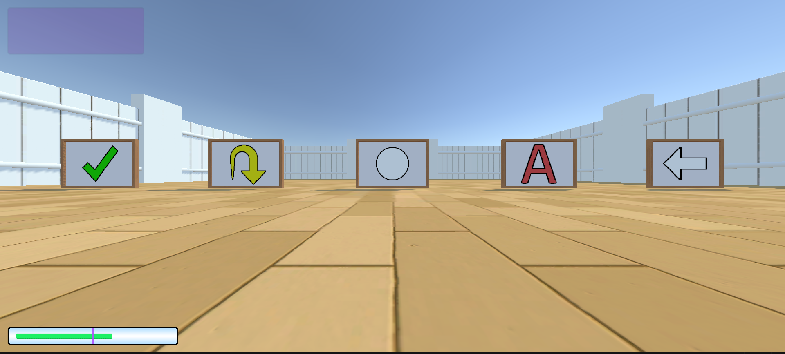

# Detailed examples

Let's take a look at some examples:

### EXAMPLE 1 - Standard Parameters & Randomisation
```
!ArenaConfig
arenas:
  0: !Arena
    t: 0
    items:
    - !Item
      name: Wall
      positions:
      - !Vector3 {x: 10, y: 0, z: 10}
      - !Vector3 {x: -1, y: 0, z: 30}
      colors:
      - !RGB {r: 204, g: 0, b: 204 }
      rotations: [45]
      sizes:
      - !Vector3 {x: -1, y: 5, z: -1}
    - !Item
      name: CylinderTunnel
      colors:
      - !RGB {r: 204, g: 0, b: 204 }
      - !RGB {r: 204, g: 0, b: 204 }
      - !RGB {r: 204, g: 0, b: 204 }
    - !Item
      name: GoodGoal
```

First of all, we can see that the number of parameters for `positions`, `rotations` and `sizes` do not need to match. The environment will spawn `max( len(positions), len(rotations), len(sizes) )` objects, where `len()` is the length of the list. Except in special-parameter cases, any missing parameter will be assigned a randomly generated value.

In this case this will lead to (in order that they will spawn):
- a pink `Cube` spawned at `[10,10]` on the ground with rotation `45` and a size randomized on both `x` and `z` and of `y=5`.
- a `Cube` spawned on the ground, with a random `x` and `z=30`. Its rotation, size  and color will be random.
- three pink `CylinderTunnel` objects, completely randomized.
- a `GoodGoal` randomized.
- the agent with position and rotation randomized.

&nbsp;

### EXAMPLE 2 - Decay Goals / Size-Changing Goals
```
!ArenaConfig
arenas:
  0: !Arena
    pass_mark: 0
    t: 250
    items:
    - !Item
      name: Agent
      positions:
      - !Vector3 {x: 10, y: 0, z: 20}
      rotations: [90]
      skins:
      - "hedgehog"
    - !Item
      name: ShrinkGoal
      positions:
      - !Vector3 {x: 20, y: 0, z: 11}
      sizes:
      - !Vector3 {x: 0.1, y: 0.1, z: 0.1}
      symbolNames:
      - "left-arrow"
      initialValues: [2.5]
      finalValues: [1.5]
      delays: [400]
      changeRates: [-0.2]
    - !Item
      name: DecayGoal
      positions:
      - !Vector3 {x: 20, y: 0, z: 17}
      initialValues: [4]
      finalValues: [3]
      delays: [250]
      changeRates: [-0.003]
    - !Item
      name: AntiDecayGoal
      positions:
      - !Vector3 {x: 20, y: 0, z: 23}
      sizes:
      - !Vector3 {x: 0.1, y: 0.1, z: 0.1}
      initialValues: [1]
      finalValues: [1.5]
      delays: [300]
      changeRates: [-0.007]
    - !Item
      name: GrowGoal
      positions:
      - !Vector3 {x: 20, y: 0, z: 29}
      initialValues: [1]
      finalValues: [3.5]
      delays: [100]
      changeRates: [0.01]
```

This example features goals that decay, grow, shrink and 'ripen' (anti-decay). Each `Item` also has some invalid *red-herring* parameters that are used incorrectly but will not affect the outcome, nor crash the AAI environment.

The `ShrinkGoal` and `GrowGoal` does not actually use the `sizes` parameter that has been declared, but changes size according to the `initialValues` and `finalValues`.  Similarly, the size of the `DecayGoal` and `AntiDecayGoal` are given by `max(initialValue, finalValue)`, and the reward changes from `initial` to `final` over time. The `ShrinkGoal` even has an incorrectly-used `symbolNames` parameter, which are for `SignPosterboard` objects only - this is ignored.

An *animal skin* has also been used - in this case, the Agent will always spawn as a hedgehog.

<p align="center">
  
</p>

<p align="center">
  
</p>

&nbsp;

### EXAMPLE 3 - SignPosterboard (Preset Symbols)
```
!ArenaConfig
arenas:
  0: !Arena
    pass_mark: 0
    t: 250
    items:
    - !Item
      name: Agent
      positions:
      - !Vector3 {x: 10, y: 0, z: 20}
      rotations: [90]
    - !Item
      name: SignPosterboard
      positions:
      - !Vector3 {x: 20, y: 0, z: 8}
      - !Vector3 {x: 20, y: 0, z: 14}
      - !Vector3 {x: 20, y: 0, z: 20}
      - !Vector3 {x: 20, y: 0, z: 26}
      - !Vector3 {x: 20, y: 0, z: 32}
      rotations: [0, 0, 0, 0, 0]
      sizes:
      - !Vector3 {x: 1, y: 1, z: 1}
      - !Vector3 {x: 1, y: 1, z: 1}
      - !Vector3 {x: 1, y: 1, z: 1}
      - !Vector3 {x: 1, y: 1, z: 1}
      - !Vector3 {x: 1, y: 1, z: 1}
      symbolNames:
      - "left-arrow"    
      - "letter-a"    
      - "circle"    
      - "u-turn-arrow"    
      - "tick"
```

This example demonstrates the use of preset symbols declared as the list `symbolNames`, a unique parameter for SignPosterboard objects. Each symbol has a default colour that can be overridden using the `colors` list (but in this example, default colours are used).

<p align="center">
  
</p>

&nbsp;

### EXAMPLE 4 - SignPosterboard (Special Symbols)
```
!ArenaConfig
arenas:
  0: !Arena
    pass_mark: 0
    t: 250
    items:
    - !Item
      name: Agent
      positions:
      - !Vector3 {x: 10, y: 0, z: 20}
      rotations: [90]
    - !Item
      name: SignPosterboard
      positions:
      - !Vector3 {x: 20, y: 0, z: 8}
      - !Vector3 {x: 20, y: 0, z: 14}
      - !Vector3 {x: 20, y: 0, z: 20}
      - !Vector3 {x: 20, y: 0, z: 26}
      - !Vector3 {x: 20, y: 0, z: 32}
      rotations: [0, 0, 0, 0, 0]
      sizes:
      - !Vector3 {x: 1, y: 1, z: 1}
      - !Vector3 {x: 1, y: 1, z: 1}
      - !Vector3 {x: 1, y: 1, z: 1}
      - !Vector3 {x: 1, y: 1, z: 1}
      - !Vector3 {x: 1, y: 1, z: 1}
      symbolNames:
      - "01/10"    
      - "111/110/001"    
      - "001010/011000/100001/101010/111001"    
      - "0101/**10/0010/0***"
      - "13x11"
```

This example demonstrates the use of *special codes* to generate black-and-white pixel grids to use as symbols. `0` -> black, `1` -> white, and `*` is a 'joker' character that chooses to output black or white at random. The dimensions of the grid are given by the `/` character - each row between `/`s must be of the same size for the code to be valid.

Fully-random grids can be generated using the code `"MxN"`, where `M` and `N` are the grid width and height dimensions respectively.

<p align="center">
  
</p>

&nbsp;
