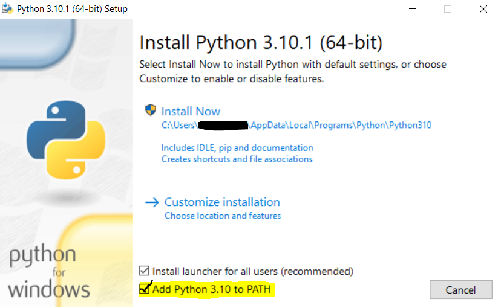
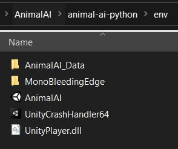

## Detailed Installation Guide

This is a more detailed installation guide for AnimalAI v3, written for users who don't have lots of experience with python dependencies, Github repositories, and/or Unity -- or in case you run into trouble with the installation *(it's custom software installation... when **isn't** there a bug or two?)*

This guide is *currently* designed predominantly for Windows users; a more detailed Mac installation guide is a work-in-progress, but most of the guide will still be useful nonetheless. Linux users tend to have stronger command-line-interface/installation experience (this coming from a Windows user!) so the quick install guide on `README.md` should be sufficient -- but please get in touch (jsh81@cam.ac.uk / @thanksphil GitHub) should you run into trouble.

### Installing Python

We recommend a newer version of Python be installed, but any version 3.x is fine. Python is generally easy to install:
* [Download](https://www.python.org/downloads/) -- default `.exe` download is fine, but unpacking a `.zip` download or Mac `.pkg` will also work
* Run the download and follow the installation guide. Default installation settings are fine, but it is recommended to tick the `"Add to PATH"` box, so that Python can be run via the Windows Command Prompt by typing 'python' in any directory:

* If you're doing a custom intallation, it is recommended to keep the "install pip" box ticked and use `pip` to install dependencies later on -- but you can use an alternative method e.g. `conda`

### AnimalAI v3 Repository

It's a good idea to create a 'root' folder ready for cloning the main repository, so that you can also keep your own training scripts, a Python virtual environment, and any other external AAI-related work in the same location, and any unrelated folders are kept separate.

Cloning this repository can then be done either by:
* Downloading the `.zip` directly and extracting it into your 'root' folder
* If you have [GitHub Desktop](https://desktop.github.com/) (available on Windows **and** Mac), you can clone it directly by clicking "Open with GitHub Desktop" on the repo webpage
* Cloning using GitHub's command line interface [(GitHub CLI)](https://docs.github.com/en/github-cli/github-cli/about-github-cli)

It will be saved by default as "animal-ai-main" but can be renamed to something more obvious like "animal-ai-repo" or "animal-ai-python" if you have other AAI folders (e.g. if you have also cloned the [AAI Unity Project repo](https://github.com/mdcrosby/animal-ai-unity-project))

### (Optional) Creating/Activating a Virtual Environment

Virtual environments in Python are useful for managing packages for separate projects; sometimes you might only want specific packages for a specific project, so you can create a virtual environment for a project and install packages *local* to that environment / project, that will not be accessible to Python when you use it outside of the virtual environment.

To create one for AnimalAI:
* Using Python directly:
    * Open a Command Prompt terminal and navigate to a convenient folder (`:C\`, `:C\Users\Name` and `:C\Users\Name\NewlyCreatedAAIRootFolder` are all good choices!)
    * Type `python -m venv your_env_name`, where `your_env_name` can be anything you like e.g. "AAI_venv", so long as it doesn't contain spaces
    * To use the virtual environment, navigate to its folder, then type `cd Scripts`, then `activate`. Your Command Prompt should now show your virtual environment name next to the directory you are in

* For **[conda](https://docs.conda.io/projects/conda/en/latest/user-guide/tasks/manage-environments.html)** users:
    * In any directory run `conda create --name your_env_name` and by default it will be created in the `envs` folder wherever you have installed conda
    * To activate it, type `conda activate your_env_name`

**Note:** folder navigation in Windows is performed using the `cd` command, e.g. if the current directory is shown as `:C\Users\Name` and you want to go to your new AAI root folder called "AAI", you would type `cd AAI` and it will now show you are at `:C\Users\Name\AAI`. To go to the *parent* directory (e.g. in this case `:C\Users`), you would type `cd..` and if your directory name contains spaces, use speech marks e.g. `cd "AAI Folder"` 

### Python Dependencies

Everything you need to run scripts in AnimalAI v3 (including the correct version of Unity's `ml-agents` package) is found in the Python package `animalai`. You can install this via `pip` or `conda`, with or without a virtual environment created -- if you're more familiar with a particular method here it's probably best to stick to it.

* Open a Command Prompt terminal and, if you are using a virtual environment, make sure to `activate` the environment first! (See above)
* Navigate to your AAI root folder, then go to your cloned repository "animal-ai-main" (or whatever you named it)
* If using **pip**:
    * Run `pip install -e animalai` (if this doesn't work, ensure pip is installed correctly; `pip --version` shows the version you have installed to confirm this)
* If using **conda**:
    * AnimalAI does not have a package build that is directly compatible with conda itself, but you can still install it indirectly for use in conda
    * Run `conda install pip` then (making sure you're in the main repository folder as instructed above) run `pip install -e animalai` as described for pip users

### Downloading the AAI Environment

Find the Windows/Mac/Linux environment download links as seen in `README.md`, and download a `.zip` copy of the environment according to your operating system. The **entire content** of the `.zip` download needs to then be extracted/unzipped into the `env` folder found in the main repository (along with `configs`, `docs`, `examples` and so on...)

Sometimes `.zip` folders unzip themselves into their own sub-folder, so it can get a bit confusing. Your `env` should look like this:

In other words, the AnimalAI Unity `.exe` should be directly contained in the `env` folder along with everything else from the `.zip` contents.

You can then start using AnimalAI v3! Any problems, please get in touch (jsh81@cam.ac.uk / @thanksphil GitHub) and we can try to help.
